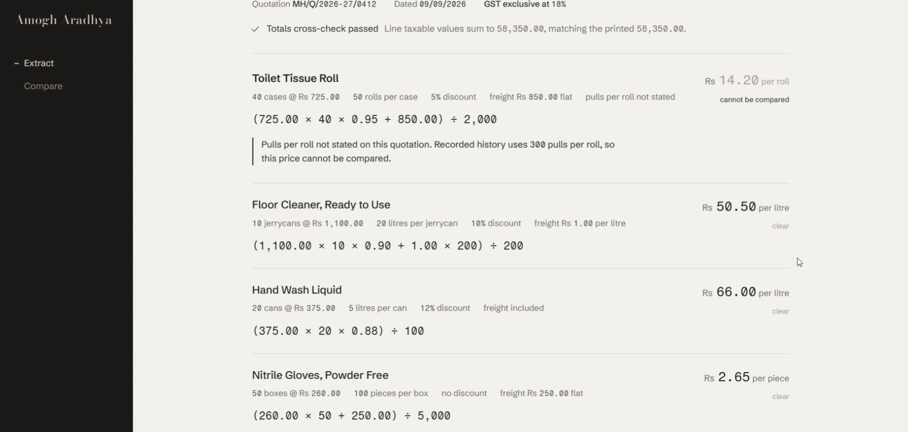
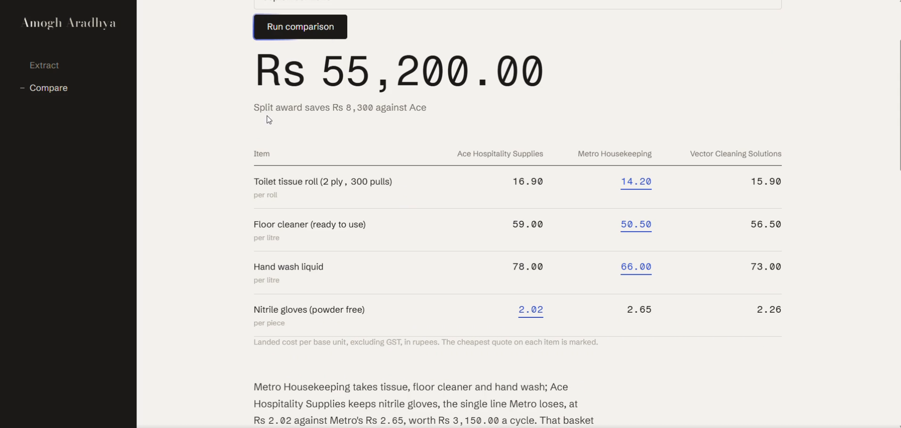

<p align="center">
  
</p>

<p align="center">
  <a href="#1-try-it-in-two-minutes">Try it</a> •
  <a href="#2-what-you-need">What you need</a> •
  <a href="#3-setting-it-up">Setup</a> •
  <a href="#4-where-the-secrets-go">Secrets</a> •
  <a href="#5-where-to-make-your-changes">Configuration</a> •
  <a href="#6-using-it">Using it</a> •
  <a href="#7-changing-the-calculation">The calculation</a> •
  <a href="#8-how-it-is-put-together">Structure</a>
</p>

<p align="center">
  
  
  
  
  
  
</p>

# Landed

Reads a vendor quotation PDF, converts every line to a landed cost per unit you actually
consume, lets you correct the reading before anything is saved, appends the approved rows to
a Google Sheet, and writes a comparison of that month's quotes against everything quoted
before.

Vendors price the same products in different pack sizes, with different discounts and freight
terms. The printed rate is not what the thing costs. A case of 50 at 725 less 5% plus 850
freight is 14.20 a unit, and that is the only figure worth comparing.

The model reads documents and writes prose. Every landed cost is calculated in Python. The model is never asked to do arithmetic.

**This repository ships configured for a fictional hotel buying cleaning consumables.** That
is a placeholder. Nothing about hotels is written into the code or the prompts.

---

## 1. Try it in two minutes

No keys, no Google account, no particular PDF.

```
git clone https://github.com/RTN107/landed.git
cd landed
uv sync
uv run python scripts/run_offline.py
```

Open http://localhost:8501 and drop any PDF on the upload screen. If 8501 is already taken,
Streamlit refuses to start rather than picking another port; free it or add `--port 8600`.

All three model calls and the sheet are replaced by fixtures, so the extraction is served
from `scripts/fixtures/metro_extraction.json` whatever you upload, and nothing is written
anywhere. It walks the whole flow including the row that deliberately refuses to clear.

Everything below is for running it against your own documents and your own sheet.

---

## 2. What you need

| Requirement | What for | Cost |
|---|---|---|
| [uv](https://docs.astral.sh/uv/) | Installs Python and every dependency | Free |
| Python 3.12+ | `.python-version` pins 3.14, uv fetches it | Free |
| Anthropic API key | The three model calls | Paid per call |
| Google account | Reading and appending to your sheet | Free |
| Google Cloud project with an OAuth desktop client | How the app authenticates to Sheets | Free |
| A Google Sheet shaped as in step 3.4 | Where approved quotes are stored | Free |
| A vendor quotation PDF | The document being read | Yours |

Python packages are declared in `pyproject.toml` and pinned in `uv.lock`, so `uv sync`
reproduces the environment exactly: `streamlit`, `anthropic`, `google-api-python-client`,
`google-auth-oauthlib`, `google-auth-httplib2`, `python-dotenv`, `pydantic`.

There is nothing else. No database, no Docker, no cloud services beyond Anthropic and Google
Sheets, no build step.

---

## 3. Setting it up

### 3.1 Install

```
git clone https://github.com/RTN107/landed.git
cd landed
uv sync
```

### 3.2 Anthropic API key

Create one at [console.anthropic.com](https://console.anthropic.com/settings/keys). Which
model is called is set by `MODEL` in `landed/config.py`.

Three calls are made: one when you upload a PDF, one each time you press Resubmit, one each
time you run a comparison.

### 3.3 Google OAuth client

The fiddliest step, and free. About five minutes.

1. Open the [Google Cloud Console](https://console.cloud.google.com/) and create a project.
2. APIs & Services, then Library, then enable the **Google Sheets API**.
3. APIs & Services, then OAuth consent screen. Choose **External**, fill the required fields,
   and add your own Google account under **Test users**. You do not need to publish the app
   or submit it for verification. Skipping the test user is the usual reason authorisation
   fails later.
4. APIs & Services, then Credentials, then Create Credentials, then **OAuth client ID**, and
   choose **Desktop app**.
5. Download the JSON and save it as **`credentials.json` in the project root**, beside `app.py`.

The app asks for one scope, `https://www.googleapis.com/auth/spreadsheets`. It reads the tab
it is pointed at and appends rows. It never updates or deletes an existing row.

### 3.4 Your sheet

Create a Google Sheet on the same account with a tab named exactly **`Quote DB`**, whose
first row is exactly these eight headers:

| A | B | C | D | E | F | G | H |
|---|---|---|---|---|---|---|---|
| Vendor name | Quote date | Item | Base unit | Landed cost per base unit excl. GST (INR) | Order quantity | Note | Note date |

This reference sheet shows the structure, and is the one showcased in the developer's LinkedIn post:
https://docs.google.com/spreadsheets/d/1SvX_GQ21Qqg5kiqAqCkz4XfcmdRULpcj5esbWsmfF2w/edit

Copy the **structure**, not the ID. Create your own sheet on your own account and use that
ID in step 3.5. You cannot write to the one above.

The headers must match character for character. The app refuses to read a sheet whose header
row does not match rather than guessing which column is which. To use different wording,
change `SHEET_COLUMNS` in `landed/config.py` so it agrees with your sheet. The tab name comes
from `TAB_NAME` in the same file.

One row is one vendor, one item, one quote date. A four item quotation appends four rows.
`Note` and `Note date` are yours to fill in by hand. The app never writes them, but the
comparison reads them, so a note about a late delivery or an agreed part order changes the
recommendation.

### 3.5 Secrets

Copy `.env.example` to `.env` in the project root and fill in both values. See section 4.

### 3.6 Run

```
uv run streamlit run app.py
```

On the first run a browser opens asking you to authorise against your Google account. Approve
it and `token.json` is written beside `credentials.json`. Later runs reuse that token and go
straight to http://localhost:8501. If 8501 is already taken, Streamlit refuses to start; free
it or run with `--server.port 8600`.

---

## 4. Where the secrets go

Three files, all in the project root, all listed in `.gitignore`. None is ever committed.

| File | What it holds | How it gets there |
|---|---|---|
| `.env` | `ANTHROPIC_API_KEY` and `GOOGLE_SHEET_ID` | You create it by copying `.env.example` |
| `credentials.json` | Your Google OAuth desktop client | You download it in step 3.3 |
| `token.json` | Your Google access and refresh token | Written automatically on first run |

`.env` takes exactly two lines:

```
ANTHROPIC_API_KEY=sk-ant-...
GOOGLE_SHEET_ID=the-id-from-your-sheet-url
```

The sheet ID is the long string in your sheet's URL between `/d/` and `/edit`.

Treat `token.json` as a live credential for your Google account. If you ever share this
folder, delete it first.

Nothing else reads the environment. No other keys, no service accounts, no secrets in code.

---

## 5. Where to make your changes

**Everything specific to a business lives in one block at the bottom of `landed/config.py`.**
Nothing business specific is written into the Python or into the prompt files. The prompts
carry `{tokens}` filled from that block at call time, and `landed/schema.py` builds the
extraction's enums from the same lists, so this one file is the whole surface.

### Required before it will read your quotations

| Setting | What it controls | If you get it wrong |
|---|---|---|
| `VENDORS` | Vendor names the extraction will accept | A quotation from anyone else fails validation |
| `PACK_UNITS` | Pack formats a quotation may be priced in, such as case or drum | A quotation in an unlisted pack fails validation |
| `BASE_UNITS` | The units you consume and compare on | A quotation in an unlisted unit fails validation |
| `ITEM_NAME_MAP` | Each vendor's exact wording mapped to the one name you store | An unmapped item is held back from the sheet and shown on the review screen |
| `SPEC_REFERENCE` | Quantities hidden in a unit name, and the figure your history is kept at | Prices recorded on different bases get compared as if equal |

These lists are closed deliberately. A quotation naming something not in them is rejected by
the extraction rather than quietly recorded as the wrong vendor or the wrong unit.

### Context the model is given

| Setting | What it controls |
|---|---|
| `CUSTOMER_NAME` | Who the prompts say they are buying for |
| `BUSINESS_CONTEXT` | Two or three sentences telling the model what your organisation is and what it buys. The largest single lever on output quality, because the same numbers deserve different judgement in a clinic and on a building site |
| `SPEC_QUALIFIER_GUIDANCE` | Which of your items carry a hidden qualifier, so the model labels it even when the document omits the number. This labelling is what lets a line be flagged uncomparable instead of silently compared |
| `ITEM_EXAMPLES` | Two ways a reviewer might casually refer to one of your items, so a loose comment matches the right line |

### Money, tax and wording

| Setting | What it controls |
|---|---|
| `CURRENCY_SYMBOL` | Prefixes every figure on screen and in the prompts |
| `CURRENCY_NAME` | The word used in prose, such as rupees or pounds |
| `TAX_NAME` | Your recoverable sales tax by the name your documents use: GST, VAT, sales tax |
| `PLURALS` | Irregular plurals for display. Anything unlisted just gets an "s" |
| `COMMENT_PLACEHOLDER` | The greyed-out example in the review screen's comment box |
| `NAMEPLATE` | The name at the top of the sidebar |

### Sheet wiring

| Setting | What it controls |
|---|---|
| `TAB_NAME` | Which tab is read and appended to |
| `SHEET_COLUMNS` | The eight headers the app expects, in order |
| `MODEL` | Which Claude model is called. Must be a model id your Anthropic account can call; the shipped default is `claude-opus-5` |

### The prompt tokens

If you rewrite a prompt in `landed/prompts/`, these are available. A prompt using none of
them still works, and an unrecognised token is left visible in the text rather than raising.

| Token | Filled from |
|---|---|
| `{customer}` | `CUSTOMER_NAME` |
| `{business}` | `BUSINESS_CONTEXT` |
| `{vendors}` | `VENDORS`, comma separated |
| `{pack_units}` | `PACK_UNITS`, comma separated |
| `{base_units}` | `BASE_UNITS`, comma separated |
| `{spec_guidance}` | `SPEC_QUALIFIER_GUIDANCE` |
| `{spec_example}` | The first key of `SPEC_REFERENCE` |
| `{item_examples}` | `ITEM_EXAMPLES` |
| `{currency}` | `CURRENCY_SYMBOL` |
| `{currency_name}` | `CURRENCY_NAME` |
| `{currency_name_singular}` | `CURRENCY_NAME` without a trailing "s" |
| `{tax}` | `TAX_NAME` |

To check your edits without spending anything:

```
uv run python -c "import sys;sys.path.insert(0,'.');from landed.claude import load_prompt;print(load_prompt('extraction'))"
```

### What is deliberately not a placeholder

The arithmetic. See section 7.

---

## 6. Using it

**Upload.** One PDF on the Extract screen. It goes to the model as a document and comes back
as structured JSON matching `landed/schema.py`. The model transcribes what is printed and
returns null for anything absent. It never estimates.

**Review.** Nothing is saved yet. Every row shows what was read, the arithmetic that produced
the figure, and the figure itself. Rows come back in one of three states:

- **Clear.** Computed and comparable.
- **Blocked.** Either no cost could be computed, because something needed was not printed, or
  a cost was computed but cannot be fairly compared, because a `SPEC_REFERENCE` qualifier was
  missing. The figure still shows, greyed, with a sentence explaining why it is held back.
- **Low confidence.** Read, but the model was unsure of the reading, with its reason shown.

A totals cross-check runs over the whole quotation. If the line values do not sum to the
printed total, every row is marked for attention regardless of its own state.

**Resubmit.** Type the missing fact into the comment box and press Resubmit. The previous
JSON and your comment go back to the model, never the PDF again, so fields you did not
question are not re-read. Changed rows are marked when they return. Repeat as often as needed.

**Approve.** Appends one row per line item to your sheet. Items with no `ITEM_NAME_MAP` entry
are not written and are listed on the confirmation screen instead.

**Compare.** Choose a month and press Run comparison. The app re-reads the sheet fresh, splits
it into that month's quotes and everything before, builds the table and trend strip in Python,
and asks the model for the written verdict. The table is never produced by the model.

<p align="center">
  
</p>

---

## 7. Changing the calculation

**This is intentionally not configurable.** The formula is the substance of the tool rather
than a setting, and it should be read and understood before being changed. It lives in
`convert_line()` in `landed/convert.py`.

```python
base_units = pack_quantity * units_per_pack
gross      = quoted_rate * pack_quantity
net        = gross * (1 - discount_percent / 100)
freight    = flat, or per_unit * base_units, or 0 if included
taxable    = net + freight
landed     = taxable / base_units
```

**The order is the point.** Discount applies to goods only, so it is taken before freight is
added, because freight is not discounted. The division to a per unit figure comes last,
because a flat freight charge only resolves into a per unit number once the total quantity is
known. Reordering these silently produces plausible wrong answers.

Change it if any of the following is not true for you:

- **Tax is excluded from cost.** The landed cost excludes tax entirely, assuming you reclaim
  it and it is therefore not a cost to you. If you cannot reclaim it, tax belongs in the
  figure and you should add it after `taxable`.
- **Freight is not discounted.** If your suppliers discount freight too, move it above the
  discount line.
- **There is nothing else in the landed cost.** Duty, insurance, storage and handling are not
  modelled. Each would be another term before the final division.
- **Two decimal places is right.** Rounding happens only at display and at write, via `round2`.
  Intermediate values are full precision `Decimal` and should stay that way.

`SPEC_REFERENCE` normalisation is separate and sits just after the formula: a quote stating a
different figure is rescaled to your reference, and a quote stating none is blocked from
comparison instead of being guessed at.

After any change, run the arithmetic check in section 9. It asserts every intermediate value,
not just the final figure, so it will tell you precisely what moved.

---

## 8. How it is put together

| Path | What it is |
|---|---|
| `app.py` | Entry point: page config, shell, routing between the two screens |
| `landed/config.py` | Secrets, sheet wiring, and the placeholder block you edit |
| `landed/convert.py` | The arithmetic, blocking rules, totals cross-check, sheet rows |
| `landed/claude.py` | The three model calls, and prompt token rendering |
| `landed/schema.py` | The structured-output schema, with enums built from your config |
| `landed/prompts/` | One markdown file per prompt, read fresh on every call |
| `landed/sheets.py` | OAuth, read the tab, append rows |
| `landed/compare.py` | Month scoping, decision and history split, table, trend strip |
| `landed/ui/shell.py` | Palette, type, motion, nameplate, sidebar, buttons, loading |
| `landed/ui/extract_screen.py` | Upload, extracting, review, written |
| `landed/ui/compare_screen.py` | Month selector, comparison, verdict |
| `scripts/` | The checks below, plus the offline runner |
| `static/fonts/` | Bodoni Moda, Schibsted Grotesk, Fragment Mono, all OFL, served locally |

Prompts are read from disk on every call, so you can edit one while the app is running and
the next call picks it up. Everything else needs a restart.

---

## 9. Checking each piece

When something does not work, these narrow it down. The first two touch your sheet, the third
spends money, the fourth is free and offline.

```
uv run python scripts/01_read_sheet.py          # proves OAuth and the sheet wiring
uv run python scripts/02_append_dummy.py        # proves write access, --cleanup undoes it
uv run python scripts/03_extract_pdf.py x.pdf   # one real extraction, prints the JSON
uv run python scripts/04_check_conversion.py    # checks the arithmetic, free, no credentials
```

Run the fourth after any change to `convert.py` or to the placeholder block.

---

## 10. Limits

Local only. No login, and the Google OAuth desktop flow needs a browser on the same machine,
so this is not built to be hosted.

One quotation per session, one PDF at a time. No queue, no undo, no audit trail.

Errors surface rather than being swallowed. Calls are not wrapped in broad exception handlers,
because a clear failure beats a silent wrong number.

Text-based PDFs only. Scanned or photographed documents are not handled.

The data in `scripts/fixtures/` and in the reference sheet is fictional. The organisation, the
vendors and their quotes were invented for this project.
